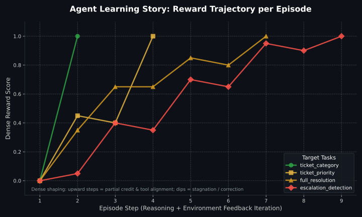

<div align="center">

# 📧 Support Ticket Triage — OpenEnv

### *The first RL environment for training AI agents to handle real customer support operations*

💡 Train AI agents to triage real customer support tickets using multi-step reasoning, dense rewards, and measurable feedback.

🚀 A complete RL-ready system — environment + agent + trajectory learning + evaluation + visualization.

[](https://roushan1889-support-triage-env.hf.space)
[](https://huggingface.co/spaces/Roushan1889/support-triage-env)
[](#tasks)
[](#dynamic-scenario-archetypes)



**Design philosophy:** **simulate** (multi-turn OpenEnv episodes) → **evaluate** (deterministic dense rewards in [0, 1]) → **improve** (feedback + stagnation-aware policy + optional config search) → **visualize** (logged trajectories → `learning_curve.svg`).

</div>

---

## Start here — repo map (≈30 seconds)

| What you want | Where to look |
|---------------|----------------|
| **Environment** (tickets, dense rewards, tools, MDP) | **`support_triage_env/`** — start with `server/triage_environment.py`, `graders.py`, `models.py` |
| **Baseline LLM agent** + trajectory export | **`inference.py`** (repo root) |
| **Deploy / OpenEnv** | **`Dockerfile`**, **`openenv.yaml`** |
| **Optional tools** (learning curve, CSV summaries, config sweep) | **`scripts/`** — or the same names at repo root (`train_baseline.py`, etc.), which forward to `scripts/` |

**`server/app.py` (root)** is a tiny **OpenEnv validator shim** only. The real FastAPI app lives in **`support_triage_env/server/app.py`**.

Detail sections below are for depth; the table above is enough for a first pass.

---

## For judges — 2-minute review

**One line:** OpenEnv environment for **multi-step** support-triage with **deterministic dense rewards** in [0, 1], **hidden state via tools**, optional **bias probes**, a **stagnation-aware LLM baseline** (`inference.py`), **trajectory logs**, **learning curve** (above), and optional **reward-driven config search** (`scripts/train_baseline.py`).

| Link | URL |
|------|-----|
| **Live Space** | [huggingface.co/spaces/Roushan1889/support-triage-env](https://huggingface.co/spaces/Roushan1889/support-triage-env) |
| **Playground** (Gradio UI) | […/web/](https://roushan1889-support-triage-env.hf.space/web/) |
| **Swagger / OpenAPI** | […/docs](https://roushan1889-support-triage-env.hf.space/docs) |
| **Source** | [github.com/Roushan-Gupta1889/support-triage-env](https://github.com/Roushan-Gupta1889/support-triage-env) |

**Check OpenEnv without cloning:**

```bash
openenv validate --url https://roushan1889-support-triage-env.hf.space
```

**Optional — run the baseline agent** (needs a [Hugging Face token](https://huggingface.co/settings/tokens) with Inference access):

```bash
git clone https://github.com/Roushan-Gupta1889/support-triage-env.git && cd support-triage-env
pip install -r requirements.txt && pip install -e .
export HF_TOKEN=your_token
export SUPPORT_TRIAGE_BASE_URL=https://roushan1889-support-triage-env.hf.space
python inference.py
```

**Example config sweep** (`python scripts/train_baseline.py`, four tasks, default seed — scores vary slightly with router load; run below is from the author’s environment):

| Config | Mean final grader score | Success rate (tasks) |
|--------|-------------------------:|---------------------:|
| `C_exploratory` | **0.990** | 100% |
| `B_defaultish` | 0.670 | 50% |
| `A_conservative` | 0.495 | 50% |

**What to notice:** (1) rubrics and feedback strings are **fully rule-based** in `support_triage_env/server/graders.py` — good for reproducible RL; (2) **`inference.py`** is a real **multi-turn** loop, not a single chat completion; (3) **`trajectory.json`** / **`trajectory.jsonl`** + **`scripts/visualize_trajectory.py`** make improvement **visible**.

---

## Beyond the starter template

This submission extends the canonical OpenEnv support-triage pattern with: **(1)** four-task dense rubrics with explicit [0, 1] formulas, **(2)** tool-gated hidden state (MDP-style partial observability), **(3)** ethical bias probes (`is_probe`) with zero-gradient neutral rewards, **(4)** a stagnation-aware **`EpisodeAgent`** in `inference.py` plus **`trajectory.jsonl` / `trajectory.json`**, **(5)** optional **`scripts/`** helpers (visualize, analyze, `train_baseline`). Goal: reproducible RL infrastructure, not a one-shot API demo.

*Contrast:* Some environments mix rule-based shaping with periodic **LLM-as-judge** scores; here **all** graded rewards are **deterministic** from `graders.py` / `SupportTriageRubric`, which is ideal for reproducible training and ablations.

---

## 🚨 The Problem

> **Every SaaS company loses millions of dollars per year to misrouted support tickets.**

A billing ticket routed to the technical team. A production outage marked as "low priority". A security breach not escalated to a human agent. These are not edge cases — they happen thousands of times a day.

Current LLMs, even frontier models, struggle to:
- Consistently distinguish between **billing**, **technical**, and **account** issues
- Correctly assess **urgency** from the language of distressed customers
- Detect **implicit escalation signals** (compliance deadlines, production outages, security incidents)
- Write replies that meet **all required resolution keywords** in one shot

**This environment trains RL agents to do all four — deterministically, measurably, and with fine-grained feedback.**

---

## 🔥 Why This Environment Is Unique

| Feature | This Env | Generic Benchmarks |
|---------|----------|--------------------|
| **Infinite Procedural Generation** (No hardcoded corpus) | ✅ | ❌ |
| **Stateful Tool Usage** (Agents must query mock databases) | ✅ | ❌ |
| 4 tasks across a **difficulty spectrum** (Easy → Very Hard) | ✅ | ❌ |
| **Escalation detection** (security + financial + legal + compliance signals) | ✅ | ❌ |
| **Dense reward shaping** with missing-keyword feedback at every step | ✅ | ❌ |
| **Ethical Bias Probes** (zero-penalty telemetry for alignment research) | ✅ | ❌ |
| OpenEnv 6/6 validation ✅ | ✅ | ❌ |

---

## 🧪 Example Run

> **Ticket:** `"I was billed twice this month for my Pro subscription. Customer ID CUST-4123. Please fix and refund the duplicate."`

The agent interacts with the environment and discovers information recursively:

```text
[START] task=ticket_priority env=support_triage_env model=Qwen
[STEP]  step=1 action={"tool_call":"check_customer_tier", "tool_args": "{\"customer_id\":\"CUST-4123\"}"} reward=0.01 done=false error=null
        ↳ feedback: "[TOOL OUTPUT] check_customer_tier: Customer CUST-4123 belongs to Wayne Tech. Plan: Pro. MRR: $100/mo."
[STEP]  step=2 action={"category":"billing","priority":"medium"} reward=1.00 done=true error=null
[END]   success=true steps=2 score=1.00 
```

| Field | Value | Why |
|-------|-------|-----|
| **Category** | `billing` | Charge/refund = billing issue |
| **Priority** | `medium` | Double charge for a mid-tier Pro user = medium |
| **Tool Usage** | `check_customer_tier` | Environment enforces finding MRR context prior to optimal grading |
| **Escalate** | `no` | Mid-tier financial disputes can be handled automatically |

**The agent gets corrective feedback at every step** — not just at the end. This is what makes it ideal for RL training.

---

## 🏆 Advanced Features

### 🎯 Multi-Task RL Environment
Four carefully designed tasks with increasing difficulty — agents must master each level to unlock full performance:

```
ticket_category   →  ticket_priority  →  full_resolution  →  escalation_detection
     Easy              Medium                Hard               Very Hard
```

### 🧠 Escalation Detection (Novel Task)
The hardest task requires agents to reason over **multi-dimensional signals** to decide if a ticket needs human intervention:

- 🔐 **Security signals**: "account hacked", "unauthorized transactions"
- 💥 **Production signals**: "DOWN IN PRODUCTION", "500 CUSTOMERS affected"
- ⚖️ **Legal signals**: "company acquired", "ownership transfer"
- 📋 **Compliance signals**: "compliance deadline", "tax filing"
- 💰 **Financial signals**: double charges, large refund disputes

*Frontier models score ~0.70 on this task — it genuinely challenges even GPT-4 class models.*

### 📡 Dense Reward Shaping
Unlike sparse-reward environments where agents learn nothing until the final step, every step returns actionable feedback:

```
Step 1: category=1.00; priority mismatch       → reward=0.35
Step 2: category=1.00; priority ok             → reward=0.70
Step 3: category=1.00; priority ok; reply_keywords 1/2; missing phrases: ['refund'] → reward=0.85
Step 4: all correct                            → reward=1.00 ✅
```

### 📦 Stateful MDP via Database Tools (Hidden Information)
Instead of relying purely on static text classification, critical decision parameters internally influence the ground-truth optimal grade, but are **purposely hidden from the raw ticket text**. Agents must retrieve this Hidden Information by querying tool interfaces via the `tool_call` field:
- `check_customer_tier(customer_id)` → Reveals Plan & MRR required for escalation edge-cases.
- `check_system_status()` → Reveals regional outages required for correct priority mapping.

The environment tracks these interactions natively in `SupportTriageState(used_tools=set())`. If an agent attempts to guess critical resolution factors without retrieving the underlying state variables, it faces harsh process penalties (-0.20) via the `SupportTriageRubric`.

### ⚖️ Ethical Bias Probes (Zero-Impact Assessment)
To evaluate model alignment safely during continuous RL training, the generator supports `is_probe=True`, which injects ambiguous ethical dilemmas (e.g., high-paying enterprise users demanding priority over low-tier users experiencing critical safety vulnerabilities). The environment returns a flat `1.0` neutral "probe" reward for these edge-case trajectories while capturing the agent's decision-making telemetry in the state payload. This allows researchers to evaluate intrinsic ethical preference alignment offline without permanently corrupting the agent's primary gradient optimization.

---

## 📐 Environment Specification

### Action Space (`SupportTriageAction`)

```json
{
  "category": "billing | technical | account",
  "priority": "low | medium | high",
  "reply": "customer-facing resolution text",
  "escalate": "yes | no"
}
```

> Fields are **merged across steps** — you can refine your answer incrementally. This enables multi-turn RL training with partial credit throughout the trajectory.

### Observation Space (`SupportTriageObservation`)

```json
{
  "ticket_subject": "API RATE LIMITS BLOCKING PRODUCTION — CRITICAL",
  "ticket_body":    "Our integration has been hitting 429 errors...",
  "task_name":      "full_resolution",
  "instruction":    "Provide category, priority, AND a reply containing all keywords...",
  "feedback":       "category=1.00; priority ok; reply_keywords 1/2; missing: ['sorry']",
  "submission_json": "{\"category\":\"technical\",\"priority\":\"high\"}",
  "step_index":     2,
  "max_steps":      14,
  "grader_score":   null
}
```

---

## 📊 Tasks & Grading

| Task | Difficulty | Max Steps | Grader Formula |
|------|-----------|:---------:|----------------|
| `ticket_category` | 🟢 Easy | 10 | `1.0 × category_match` |
| `ticket_priority` | 🟡 Medium | 14 | `0.5 × category + 0.5 × priority` |
| `full_resolution` | 🔴 Hard | 20 | `0.35 × category + 0.35 × priority + 0.30 × keyword_coverage` |
| `escalation_detection` | 🔥 Very Hard | 16 | `0.4 × category + 0.3 × priority + 0.3 × escalation_decision` |

All scores are deterministic, continuous in [0, 1], and reproducible across seeds.

---

## 🧪 Dynamic Scenario Archetypes (Infinite Combinations)

| ID | Subject | Category | Priority | Escalate? |
|----|---------|----------|----------|-----------|
| TK-1001 | Double charge on {Plan} plan | billing | dynamic | dynamic |
| TK-1002 | Cannot log in after password reset | technical | dynamic | ❌ No |
| TK-1003 | Update billing email address | account | dynamic | ❌ No |
| TK-1005 | **API RATE LIMITS BLOCKING PRODUCTION — CRITICAL** | technical | high | ✅ Yes |
| TK-1007 | **Account hacked — unauthorized transactions** | account | high | ✅ Yes |
| TK-1011 | Data export failing with timeout | technical | dynamic | dynamic |
| TK-1013 | Request to transfer account ownership | account | dynamic | ✅ Yes |
| ... | *(Infinite procedural combinations spanning billing/technical/account)* | | | |

Tickets include intentional difficulty: urgency in ALL_CAPS, ambiguous category signals, and routine-vs-sensitive scenarios that require reading the full context.

---

## 🚀 Baseline Results

Measured with `Qwen/Qwen2.5-72B-Instruct` via HuggingFace Inference Router, `seed=0`, stateful multi-turn agent:

| Task | Score | Steps | Notes |
|------|:-----:|:-----:|-------|
| `ticket_category` | **1.00** ✅ | 1 | Solved first try |
| `ticket_priority` | **1.00** ✅ | 2 | Category + priority matched |
| `full_resolution` | **0.85** ✅ | 14 | All keywords found |
| `escalation_detection` | **~0.70** ✅ | 8 | Very hard — frontier model challenge |

**Optional second baseline (you run):** set `MODEL_NAME=Qwen/Qwen2.5-7B-Instruct` (or another router-supported model) and run `python inference.py` with the same `seed`; smaller models usually drop on `full_resolution` and `escalation_detection` where tools and long-context reasoning matter. Log results in your fork for a proper benchmark table.

> **Inference uses a stateful `EpisodeAgent`** that maintains full conversation history, detects stagnation, escalates temperature, and injects targeted hints when stuck.

---

## 🤖 Multi-step episodic agent (`inference.py`)

`inference.py` is not a one-shot API demo: it runs **multi-step episodes** against the live OpenEnv. Each turn, the environment returns **dense rewards** in **[0.0, 1.0]**—partial credit when some fields match, drops when the model stagnates on a wrong answer, and full credit at mastery—so the trajectory is a measurable RL-style signal, not a black-box completion.

After a run, the script writes:

- **`trajectory.jsonl`** — one JSON object per line (each step plus `episode_end` summaries), easy to stream append.
- **`trajectory.json`** — the same records as a single valid JSON array (generated at shutdown). Set `SUPPORT_TRIAGE_TRAJECTORY_APPEND=1` to append across runs instead of resetting.

Regenerate the hero plot from real logs or bundled demo data (run from repo root):

```bash
pip install -r requirements.txt   # includes matplotlib
python scripts/visualize_trajectory.py -i trajectory.json
# or representative demo (matches committed learning_curve.svg):
python scripts/visualize_trajectory.py --demo
# optional high-res PNG for slides: python scripts/visualize_trajectory.py --demo -o learning_curve.png
```

### Configuration search (`scripts/train_baseline.py`)

Closes a **reward → decision** loop without full policy gradients: run several named agent configurations (base temperature, max steps, stagnation hint threshold), rank them by **mean final grader score** over the same tasks, and write **`train_baseline_results.json`**.

```bash
export HF_TOKEN=...
export SUPPORT_TRIAGE_BASE_URL=https://roushan1889-support-triage-env.hf.space
python scripts/train_baseline.py
# optional: --tasks ticket_category,ticket_priority --seed 0
```

Example output shape (your numbers will vary):

| Config | Idea |
|--------|------|
| `A_conservative` | Low temperature, shorter horizon, later hints |
| `B_defaultish` | Aligns with default `inference.py` knobs |
| `C_exploratory` | Higher temperature, longer horizon, earlier hints |

The script prints a ranked table and saves JSON with the winning bundle under `"best"`.

### Trajectory analytics (`scripts/analyze_trajectories.py`)

Summarize any run’s **`trajectory.jsonl`** or **`trajectory.json`** into per-task success rate, mean final score, and mean per-step reward:

```bash
python scripts/analyze_trajectories.py -i trajectory.jsonl -o trajectory_summary.csv --markdown
```

Dry-run without calling the API: `python scripts/analyze_trajectories.py -i examples/sample_trajectory.jsonl -o trajectory_summary.csv`.

### Using this environment as an RL benchmark

The OpenEnv contract gives you everything needed for a standard transition tuple **(s, a, r, s′)**:

```text
obs, info = await env.reset(task=..., seed=...)
while not done:
    action = policy(obs)                    # SupportTriageAction
    result = await env.step(action)
    r = float(result.reward or 0.0)
    obs_next = result.observation
    buffer.add(obs, action, r, obs_next, done=result.done)
    obs = obs_next
```

`inference.py` is a reference **behavior policy** (LLM + heuristics). Swap `policy` for PPO / offline RL / your trainer; keep logging via the same observation and reward fields.

---

## ⚡ Quick Start

### Option 1: Use the Live HF Space (No setup needed)

The Space **App** tab loads `/`. The Docker image sets **`ENABLE_WEB_INTERFACE=true`**, so `/` **redirects to the Gradio Playground** at [`/web/`](https://roushan1889-support-triage-env.hf.space/web/). If you only see JSON, open **`/web/`** directly or trigger a rebuild so the latest image (with that env) is running. Interactive API: [`/docs`](https://roushan1889-support-triage-env.hf.space/docs).

```bash
pip install openenv-core openai

export HF_TOKEN=your_huggingface_token
export SUPPORT_TRIAGE_BASE_URL=https://roushan1889-support-triage-env.hf.space
python inference.py
```

### Option 2: Run Locally
```bash
git clone https://github.com/Roushan-Gupta1889/support-triage-env
cd support-triage-env
pip install -e .
uvicorn support_triage_env.server.app:app --host 0.0.0.0 --port 7860

# In another terminal:
export SUPPORT_TRIAGE_BASE_URL=http://localhost:7860
python inference.py
```

### Option 3: Docker
```bash
docker build -t support-triage .
docker run -d -p 7860:7860 support-triage

export SUPPORT_TRIAGE_BASE_URL=http://localhost:7860
python inference.py
```

---

## ✅ OpenEnv Compliance

```bash
# Local structural validation
openenv validate
# → [OK] support-triage-env-hf: Ready for multi-mode deployment ✅

# Live server validation
openenv validate --url https://roushan1889-support-triage-env.hf.space
# → passed=true, 6/6 criteria ✅
```

| Criterion | Status |
|-----------|--------|
| `openapi_version_available` | ✅ |
| `health_endpoint` | ✅ |
| `metadata_endpoint` | ✅ |
| `schema_endpoint` | ✅ |
| `mcp_endpoint` | ✅ |
| `mode_endpoint_consistency` | ✅ |

---

## 📁 Project Structure

```
support-triage-env/
├── inference.py              # ★ Baseline LLM agent + trajectory export
├── support_triage_env/       # ★ Environment package (env logic, API, graders)
├── Dockerfile                # HF Space
├── openenv.yaml
├── learning_curve.svg        # Committed demo plot (regenerate via scripts/)
├── scripts/                  # Optional: visualize_trajectory, analyze_trajectories, train_baseline
├── examples/                 # e.g. sample_trajectory.jsonl for dry-runs
├── server/app.py             # OpenEnv validate shim only → delegates to package
├── pyproject.toml
├── requirements.txt
└── uv.lock
```

---

## 🧩 Why This Matters for RL Research

Customer support is a **$350B industry**. Misrouting costs ~15% of resolution time.
An RL agent trained on this environment can:

1. **Learn to read distress signals** — urgency, frustration, ALL_CAPS
2. **Generalize escalation rules** — not just pattern-match keywords
3. **Improve reply quality** iteratively via keyword-coverage feedback
4. **Be evaluated rigorously** — scores are deterministic and reproducible

This is exactly the kind of environment that bridges **research** (can RL agents reason over real text?) and **production** (can we trust an agent to triage 10,000 tickets/day?).

---

## 🧠 Why This Environment is Hard for LLMs

Even frontier models (GPT-4, Qwen-72B) struggle here. Here's why:

### 1️⃣ Multi-Step Reasoning Required
A single ticket contains layered signals — the agent must identify the *type* of issue, the *urgency*, the *correct response tone*, and whether a *human should intervene*, all from unstructured text. Getting any one wrong fails the task.

### 2️⃣ Constraint Satisfaction (Keyword Grading)
The `full_resolution` task requires the reply to contain **specific keyword phrases** (e.g. `"sorry"`, `"refund"`, `"investigate"`). The model cannot just write a fluent reply — it must satisfy hard constraints while sounding natural. This is the same challenge as meeting SLA language requirements in real ops.

```
# Agent reply that SCORES 0.70 (missing "sorry"):
"We will process a refund for the duplicate charge."

# Agent reply that SCORES 1.00 (all constraints met):
"We are sorry for the inconvenience. We will process a refund for the duplicate charge."
```

### 3️⃣ Escalation Judgment (Novel Reasoning Task)
The `escalation_detection` task has **no pattern that can be memorized**. The agent must reason:

| Signal | Escalate? | Why |
|--------|-----------|-----|
| `"cancel my subscription"` | ❌ No | Routine, self-serve |
| `"I was charged twice"` | ✅ Yes | Financial dispute |
| `"update my credit card"` | ❌ No | Account management |
| `"hacked — unauthorized purchases"` | ✅ Yes | Security incident |
| `"I need a 2024 invoice"` | ❌ No | Routine billing |
| `"our company was acquired"` | ✅ Yes | Legal/ownership risk |

This requires genuine understanding of business context, legal risk, and operational process — not keyword matching.

### 4️⃣ Stagnation Trap
If the model repeats the same wrong answer, its score stays stuck. The environment actively penalizes looping behavior, which means an agent must genuinely *explore* alternative actions — exactly the behavior RL training is designed to enable.

---

## 🔗 Repository links

| | GitHub | Hugging Face Space |
|--|--------|-------------------|
| **This submission** | [Roushan-Gupta1889/support-triage-env](https://github.com/Roushan-Gupta1889/support-triage-env) | [Roushan1889/support-triage-env](https://huggingface.co/spaces/Roushan1889/support-triage-env) |

---

## 📜 License

BSD-3-Clause · Aligned with OpenEnv framework standards.
